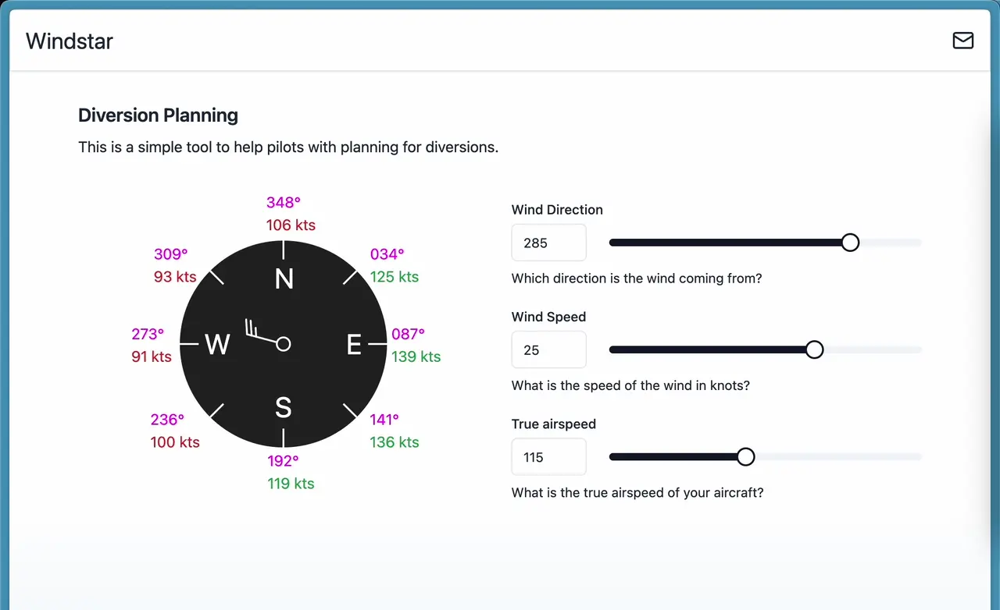

# Windstar

This is a simple tool to assist Pilots in pre-planning potential diversions. Taking into account the wind speed and direction, as well as the aircraft speed, we can calculate a wind correction angle. If planned on the ground, it means the Pilot can have accurate headings in the event of a diversion.

